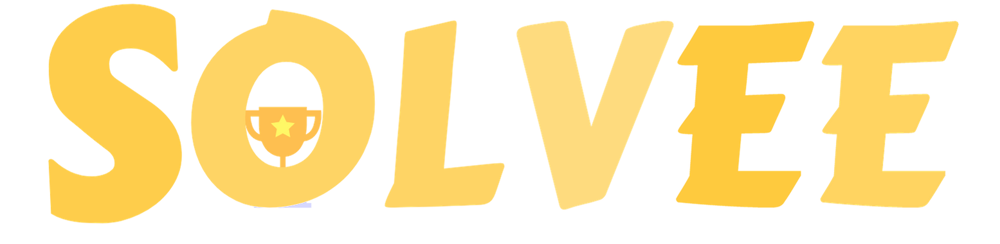
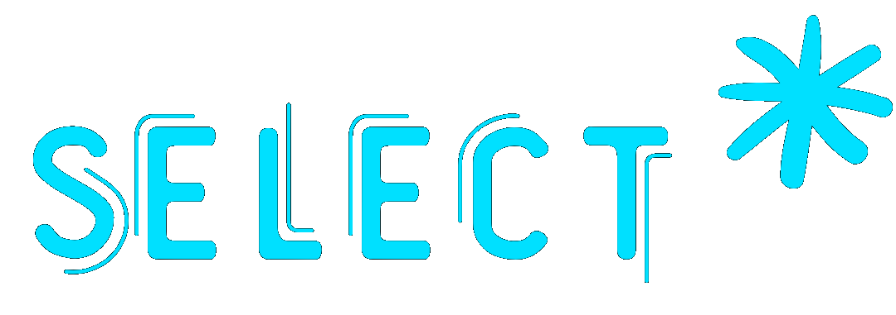

  

  
 I'm currently a computer engineering junior studying at Cairo University. I love being productive, I'm enamored by science and I'm fond of spreading knowledge and collaborating with my friends. Part of my love to productivity is conveyed in devoting time to gain more experience in different areas of engineering. Although I appreciate about all subjects that come under the umbrella of computer science, I'm notably partial to machine learningmachine learning, which is perhaps a consequence of my former love to math. I recently got distracted by Javascript and all the sorcery it provides. I do believe that being well-versed in web development has its own advantages compared to learning many other things. 

 
 
 

 
  <h2> 👨🏻‍🔧 Featured* Projects  👩🏻‍🔬</h2>
    
    
      
    
      
    
     
    
      
   

    <h2> 👨‍💻 Programming Languages & Platforms 👩‍💻 </h2>
  
  

  
  

  

   <h2> 💬 Get in touch 💬 </h2>
  
    
    
      
        
         
  

   <h2> 🌌 Explore More 🌌 </h2>
  
  
  
  

  

  
  

   <h2> 💖 Thank You 💖 </h2>

  

<!--
**EssamWisam/EssamWisam** is a ✨ _special_ ✨ repository because its `README.md` (this file) appears on your GitHub profile.

Here are some ideas to get you started:

- 🔭 I’m currently working on ...
- 🌱 I’m currently learning ...
- 👯 I’m looking to collaborate on ...
- 🤔 I’m looking for help with ...
- 💬 Ask me about ...
- 📫 How to reach me: ...
- 😄 Pronouns: ...
- ⚡ Fun fact: ...
-->
